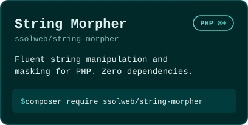
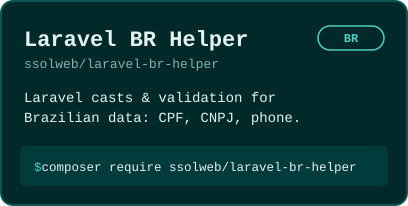
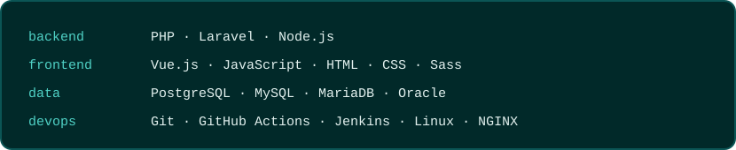

## Who am i
### Vinicius de Santana
**Software Architect | Full Stack Developer | Open Source Contributor.**

  

  

<table align="center">
  <tr>
    <td align="center">
       
      
      
    </td>
    <td align="center">
       
      
      
    </td>
  </tr>
</table>

  

  

- **[Agents Override: Local Harness in Heterogeneous Teams](https://viniciusvts.github.io/blog/agents-override-local-harness-in-heterogeneous-teams/)** · Oct 2026
- **[Git Fluid Flow: A Branching Strategy for Decoupled Task Promotion](https://viniciusvts.github.io/blog/git-fluid-flow-branching-strategy/)** · Jun 2026
- **[How I responded to a Supply Chain attack before it hit my project](https://viniciusvts.github.io/blog/reaction-to-the-tanstack-suply-chain-attack-cve-2026/)** · May 2026
- **[Choosing the ideal Git branching strategy for your project](https://viniciusvts.github.io/blog/branching-strategy-to-your-project/)** · May 2025

→ [All posts](https://viniciusvts.github.io/blog/) (in English and Portuguese)

  

- **[twbs/bootstrap](https://github.com/twbs/bootstrap)**: fixed a blockquote styling mismatch.
- **[mdn/translated-content](https://github.com/mdn/translated-content)**: removed dead links across the ES, FR, PT-BR and ZH locales.
- **[laravel/spark-next-docs](https://github.com/laravel/spark-next-docs)**: improved the legal and compliance sections.

  

  

  

  
  

